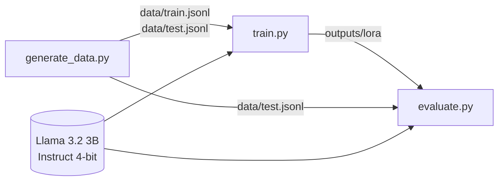

# Extracción de Rate Confirmations con Fine-Tuning LoRA

Fine-tuning de **Llama 3.2 3B Instruct** con **QLoRA** (Unsloth) para extraer datos estructurados de *rate confirmations* de transporte de carga. El modelo recibe el texto del documento, tal como llega por correo o PDF, y devuelve **solo un JSON** con los campos del viaje, listo para integrarse en un sistema de despacho o facturación.

```text
Hi, confirming the load below with TQL.

Reference L8578454. We need a dry van picking up machinery in Hobbs, NM on
November 5, 2026, delivering to Dallas, TX.
Agreed rate is $760.12 all in.
```

```json
{"broker": "TQL", "load_number": "L8578454", "origin": "Hobbs, NM", "destination": "Dallas, TX", "pickup_date": "2026-11-05", "rate": 760.12}
```

---

## Contenido

- [Cómo está construido](#cómo-está-construido)
- [Stack tecnológico](#stack-tecnológico)
- [Estructura del proyecto](#estructura-del-proyecto)
- [Scripts](#scripts)
- [Requisitos](#requisitos)
- [Instalación y uso](#instalación-y-uso)
- [Resultados](#resultados)
- [Notas técnicas](#notas-técnicas)

---

## Cómo está construido

El proyecto es un pipeline de tres etapas: generar datos, entrenar un adaptador y evaluarlo contra el modelo base.



- **Datos sintéticos.** Los ejemplos se generan con plantillas que imitan formatos reales de rate confirmations. Cada ejemplo trae su respuesta correcta, así que no hace falta etiquetar a mano, y el test incluye grupos diseñados para medir generalización.
- **QLoRA.** El modelo base se carga cuantizado a 4 bits y se mantiene **congelado**. Solo se entrenan matrices LoRA de bajo rango sobre las proyecciones de atención y del MLP. Así el entrenamiento cabe en una GPU de 8 GB, y el resultado es un adaptador de pocos MB en lugar de un modelo completo.
- **Loss solo sobre la respuesta.** Con `train_on_responses_only`, el prompt se enmascara y todo el gradiente se usa en aprender a producir el JSON, no en reproducir el documento de entrada.
- **Evaluación comparativa.** El mismo script evalúa el modelo base y el modelo con adaptador sobre el mismo test, con resultados por grupo y por campo.

---

## Stack tecnológico

| Componente | Uso |
|---|---|
| **Python 3.12** + **uv** | Entorno y gestión de dependencias (`uv.lock`) |
| **PyTorch 2.14** (CUDA 13.0) | Cómputo en GPU |
| **Unsloth 2025.5.1** | Carga en 4 bits, LoRA optimizado y parches de velocidad |
| **Hugging Face Transformers / TRL / PEFT** | Modelo, `SFTTrainer` y adaptadores LoRA |
| **bitsandbytes** | Cuantización a 4 bits y optimizador `adamw_8bit` |
| **Datasets** | Construcción del dataset de entrenamiento |

Las versiones exactas están fijadas en `uv.lock`.

---

## Estructura del proyecto

```text
fine-tunning/
├── src/fine_tunning/
│   ├── generate_data.py   # Genera el dataset sintético (train + test)
│   ├── train.py           # Entrena el adaptador LoRA
│   └── evaluate.py        # Mide la calidad de extracción (base vs. LoRA)
├── data/                  # train.jsonl y test.jsonl (generados, no versionados)
├── outputs/               # Adaptadores y resultados (generados, no versionados)
│   └── lora/              # Adaptador entrenado + tokenizer
├── pyproject.toml
└── uv.lock
```

`data/` y `outputs/` están en `.gitignore`: se reconstruyen con los scripts.

---

## Scripts

### `generate_data.py` — Dataset sintético

Genera pares **documento → JSON esperado** en formato JSONL, con los campos `instruction`, `input`, `output` y, en el test, `group`.

- **Train (550 ejemplos):** cinco plantillas (tabular, correo informal, campos etiquetados, una sola línea y direcciones completas) con variaciones de formato de fecha, prefijos de número de carga y montos.
- **Test (175 ejemplos):** seis grupos, cada uno diseñado para medir algo distinto:

| Grupo | n | Qué mide |
|---|---|---|
| `in_dist` | 50 | Mismas plantillas, brokers y ciudades que en train |
| `nuevos_valores` | 25 | Plantillas conocidas con brokers y ciudades que nunca aparecen en train |
| `nueva_plantilla` | 25 | Formato nuevo: etiquetas distintas, destino antes que origen, `USD` y fecha abreviada |
| `distractores` | 25 | Documento realista con direcciones completas, carrier y broker, varias fechas, montos y referencias |
| `correcciones` | 25 | Hilo de correo que corrige fecha y tarifa; los valores válidos son los nuevos |
| `espanol` | 25 | Documento en español, con el mes escrito en español |

La generación es **reproducible**: cada bloque usa su propia semilla, así que agregar grupos de test no altera los datos de entrenamiento.

### `train.py` — Entrenamiento del adaptador

1. Carga `unsloth/Llama-3.2-3B-Instruct-bnb-4bit` en 4 bits.
2. Aplica LoRA a `q_proj`, `k_proj`, `v_proj`, `o_proj`, `gate_proj`, `up_proj` y `down_proj`.
3. Da formato a cada ejemplo con el *chat template* de Llama 3 (usuario: instrucción + documento; asistente: JSON).
4. Enmascara el prompt para que la loss se calcule solo sobre la respuesta, e imprime lo que el modelo aprende a generar para verificarlo.
5. Entrena y guarda el adaptador y el tokenizer en `outputs/lora/`.

| Hiperparámetro | Valor |
|---|---|
| LoRA `r` / `alpha` / `dropout` | 16 / 16 / 0 |
| Longitud máxima | 1024 tokens |
| Batch efectivo | 8 (2 por dispositivo × 4 de acumulación) |
| Épocas | 3 |
| Learning rate | 2e-4, *scheduler* lineal, 5 pasos de *warmup* |
| Optimizador | `adamw_8bit` |
| Precisión | bf16 |
| Gradient checkpointing | `unsloth` |
| Semilla | 42 |

Tiempo aproximado: **7 u 8 minutos** en una RTX 4060 (8 GB).

### `evaluate.py` — Evaluación

Evalúa el modelo base o el modelo con adaptador sobre `data/test.jsonl`, con decodificación *greedy* (determinista):

```bash
uv run python src/fine_tunning/evaluate.py                # modelo base
uv run python src/fine_tunning/evaluate.py outputs/lora   # base + adaptador LoRA
```

| Métrica | Definición |
|---|---|
| **JSON válido** | La respuesta contiene un objeto `{...}` que se puede parsear |
| **JSON estricto** | La respuesta es *únicamente* el JSON, sin texto ni bloques de código alrededor |
| **Extracción exacta** | Los seis campos coinciden con lo esperado |
| **Por campo** | `rate` con tolerancia de 0.01; el resto, comparación exacta de texto |

Imprime una tabla por grupo y, para cada grupo, el primer fallo con la entrada, la salida esperada y la respuesta del modelo.

---

## Requisitos

- GPU NVIDIA con **8 GB de VRAM** o más y un driver compatible con **CUDA 13.0**
- Linux o Windows con **WSL2**
- **Python 3.12** y [**uv**](https://docs.astral.sh/uv/)

Probado en una NVIDIA GeForce RTX 4060 (8 GB) sobre WSL2.

---

## Instalación y uso

```bash
# 1. Instalar dependencias
uv sync

# 2. Generar el dataset
uv run python src/fine_tunning/generate_data.py

# 3. Entrenar el adaptador LoRA (~8 min)
uv run python src/fine_tunning/train.py

# 4. Evaluar el adaptador y el modelo base
uv run python src/fine_tunning/evaluate.py outputs/lora
uv run python src/fine_tunning/evaluate.py
```

La primera ejecución descarga el modelo base desde Hugging Face (unos 2 GB).

---

## Resultados

Extracción exacta del **adaptador v1** frente al modelo base, sobre 175 ejemplos de test:

| Grupo | LoRA v1 | Modelo base |
|---|---|---|
| `in_dist` | **100%** | 78% |
| `nuevos_valores` | **100%** | 84% |
| `nueva_plantilla` | 100% | 100% |
| `distractores` | 0% | 0% |
| `correcciones` | **64%** | 56% |
| `espanol` | 100% | 100% |
| **Total** | **81%** | 71% |
| **JSON estricto** | **99%** | 0% |

> Medido con la versión anterior del dataset: números de carga con prefijo `#` e instrucción sin el formato `City, ST`. Los cambios de la versión actual responden directamente a estos hallazgos.

**Hallazgos principales**

- **Formato:** el modelo base siempre envuelve el JSON en texto y bloques de código (0% estricto). El adaptador responde solo con el JSON, así que su salida se puede consumir directamente con `json.loads`.
- **Precisión en números:** el modelo base copia mal algunas tarifas (por ejemplo, `875.45` → `87.545`). El adaptador las copia bien, incluso con varios montos distractores en el documento.
- **Convenciones del dominio:** el adaptador aprende reglas implícitas de los datos que el modelo base no puede adivinar.
- **Direcciones completas:** los dos modelos copiaban la dirección entera en lugar de `City, ST`. Por eso la versión actual especifica el formato en la instrucción e incluye ejemplos con direcciones en el entrenamiento.

---

## Notas técnicas

- **Consistencia de tokenización entre entrenamiento e inferencia.** El *chat template* de Llama 3 ya incluye `<|begin_of_text|>`. Si se tokeniza con `add_special_tokens=True`, el prompt empieza con dos BOS, algo que el modelo nunca vio al entrenar. En este proyecto eso hacía que omitiera un campo completo en el 78% de los casos. `evaluate.py` tokeniza con `add_special_tokens=False` para que el formato coincida exactamente con el del entrenamiento.
- **Compatibilidad de versiones.** Las versiones recientes de Unsloth requieren `torch<2.13`. Con la restricción actual (`torch>=2.14.0`), el resolver usa Unsloth 2025.5.1, que funciona pero es una combinación antigua. Para actualizar Unsloth, hay que bajar el rango de `torch` y marcar el índice de PyTorch como `explicit = true` en `pyproject.toml`.

---

## Autor

**Jose de Jesus Chavez**
